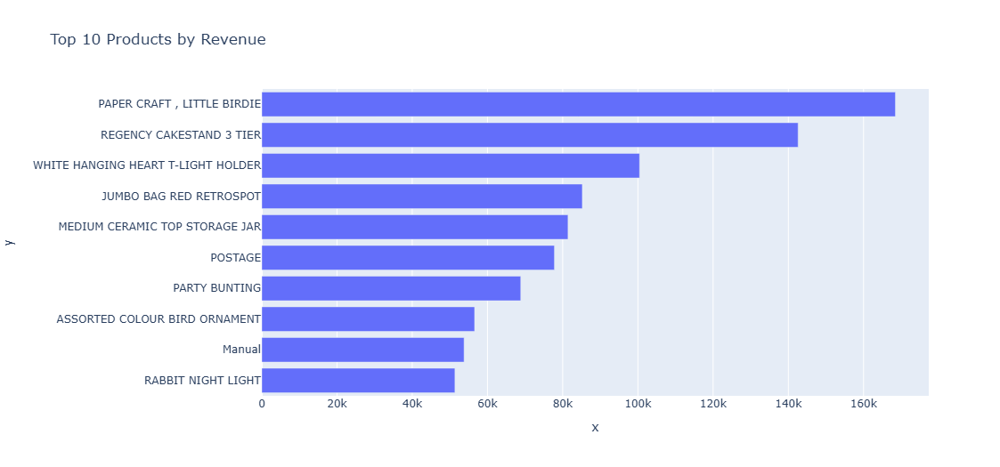
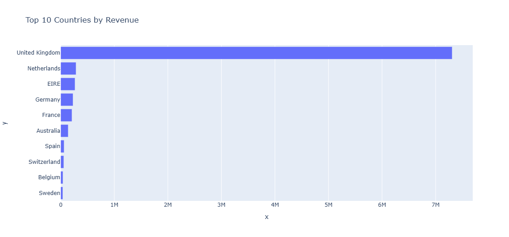
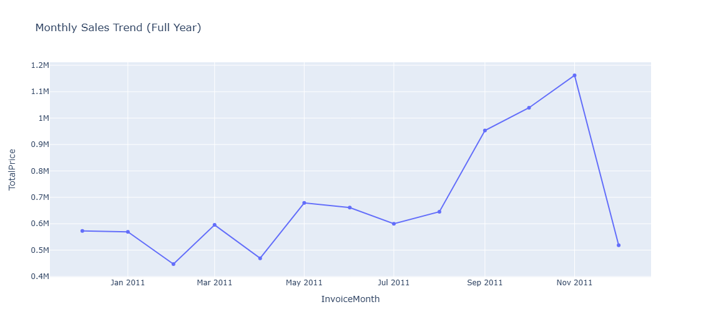
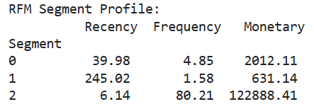
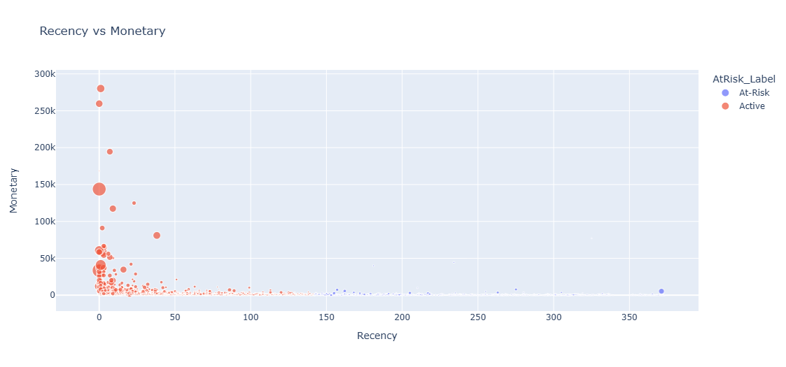
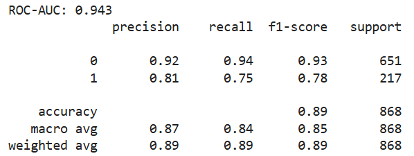

# E-Commerce Analytics: Insights for Growth & Retention  

## 1. Introduction  

Imagine running an online gift shop in the UK. Every day, hundreds of customers browse, click, and make purchases. By the end of the year, you’re managing **over 500,000 transactions** — a huge amount of data.

As a business manager, you naturally ask:

- Which products drive the most revenue?
- Which customers are slipping away?
- How can we grow sales while keeping customers loyal?

This project explores the [Online Retail dataset](https://archive.ics.uci.edu/ml/datasets/Online+Retail) (Dec 2010 – Dec 2011). Acting as a data detective, I turned raw transactions into actionable insights, using analytics, machine learning, and association rules. The goal: make data-driven decisions to increase revenue and improve customer loyalty.

---

## 2. Dataset  

- **Source:** UCI Machine Learning Repository  
- **Transactions:** 542,000 (cleaned → ~398,000 valid)  
- **Features:** Invoice, Product, Quantity, Price, Customer, Country  

Cleaning steps included:  
- Removing missing CustomerIDs.  
- Filtering out returns and negative quantities/prices.  
- Creating `TotalPrice = Quantity × UnitPrice`.  
- Extracting `InvoiceMonth` for trend analysis.  

**Why it matters:** Clean, reliable data ensures that insights are accurate and strategies are based on reality, not noise.

---

## 3. Exploratory Insights  

To understand the business landscape, we first explored **sales patterns across products, countries, and time**. This helps identify what drives revenue and where to focus efforts.

### Top Products

  

I initially expected revenue to be fairly spread across products. Surprisingly, a handful of items — like **Paper Craft Little Birdie** and **Regency Cakestand 3 Tier** — generate a disproportionate share of total sales.

**Insight:** These “star products” are the backbone of revenue. Most other products sell sporadically.

**Strategy:**  
- Feature star products prominently on the homepage and campaigns  
- Bundle star products with complementary items to boost basket value  
- Launch limited editions or seasonal variations to maintain excitement  

---

### Country-Level Revenue 

Revenue is heavily concentrated in the **UK**, which forms the core market. Other countries contribute smaller, but still valuable, portions of total sales.

**Insight:** The business relies on the UK, but international markets offer opportunities for testing promotions or new products.

**Strategy:**  
- Focus marketing and logistics on the UK to maximize returns  
- Run small-scale experiments in international markets  
- Customize promotions for each country to explore growth potential  

---

### Monthly Sales Trend

  

Sales fluctuate across months:

- **Peak in August** likely driven by summer campaigns  
- **Dip in November** possibly due to stock shortages or lower demand  

**Insight:** Seasonal trends are crucial for inventory and campaign planning.

**Strategy:**  
- Prepare stock and campaigns ahead of busy months  
- Introduce targeted discounts or promotions during slower months to maintain steady revenue  

---

## 4. Customer Segmentation

Not all customers are equal. Some shop frequently and spend a lot, while others rarely return. To understand these patterns, we applied **RFM analysis (Recency, Frequency, Monetary)**, grouping customers based on how recently they purchased, how often they buy, and how much they spend.

  

From this analysis, three clear segments emerged:

- **VIPs:** These are our most loyal customers. They shop frequently and spend the most, forming the backbone of our revenue.  
- **Mid-tier buyers:** They purchase regularly but spend moderately. With the right engagement, they have the potential to become VIPs.  
- **At-risk customers:** These customers haven’t shopped in a while or spend very little. Without targeted action, they may churn and represent lost revenue.

  

**Insight:** By identifying these segments, we can focus efforts where they matter most. Losing VIPs would hurt revenue, while reactivating at-risk customers can unlock hidden value.

**Strategy:**  
- **VIPs:** Reward loyalty with exclusive perks, early access to products, or special promotions.  
- **Mid-tier:** Encourage upselling and cross-selling with personalized offers and product recommendations.  
- **At-risk:** Launch reactivation campaigns via emails, discounts, or reminders to bring them back.

By visualizing customer behavior and acting strategically, businesses can maximize revenue, strengthen loyalty, and reduce churn — all through data-driven decisions.

---

## 5. Predicting High-Value Customers  

A key challenge in e-commerce is knowing **which customers will become top spenders**. Waiting for purchases means missing opportunities to engage them proactively.  

 

Using a **Random Forest Classifier**, we analyzed patterns based on **Recency, Frequency, Monetary,** and **Country**. The model performed exceptionally well:

- **ROC-AUC:** 0.943  
- **Precision:** 81%  
- **Recall:** 75%  

**Insight:** Instead of waiting, we can now predict which customers are likely to generate the most revenue and target them strategically.  

**Strategy:**  
- Send personalized offers to predicted high-value customers  
- Allocate marketing budgets toward those most likely to contribute revenue  
- Develop loyalty programs or exclusive bundles to retain these top customers  

---

## 6. Market Basket Analysis  

Understanding **which products are frequently bought together** can unlock additional revenue opportunities. Using **FP-Growth**, we discovered natural associations:

| Antecedents                  | Consequents                 | Support   | Confidence | Lift       |
|-------------------------------|----------------------------|-----------|------------|------------|
| HERB MARKER THYME             | HERB MARKER ROSEMARY       | 0.010153  | 0.944134   | 86.829038  |
| HERB MARKER ROSEMARY          | HERB MARKER THYME          | 0.010153  | 0.933702   | 86.829038  |
| REGENCY TEA PLATE GREEN       | REGENCY TEA PLATE ROSES    | 0.011534  | 0.845815   | 52.930211  |
| REGENCY TEA PLATE ROSES       | REGENCY TEA PLATE GREEN    | 0.011534  | 0.721805   | 52.930211  |
| POPPY'S PLAYHOUSE BEDROOM     | POPPY'S PLAYHOUSE LIVINGROOM | 0.010153 | 0.650000   | 51.769856  |

**Insights from these patterns:**  
- *Herb Marker Rosemary → Herb Marker Thyme*  
- *Regency Tea Plate* items often bought together  
- *Poppy’s Playhouse Bedroom → Livingroom* items  

These natural buying patterns highlight **cross-selling and bundling opportunities**.

**Strategy:**  
- Show “Frequently Bought Together” suggestions on product pages  
- Create bundles with complementary items  
- Encourage customers to explore related products, increasing average order value

---

## 7. Key Takeaways  

Through this analysis, several important insights emerged:

- Star products dominate revenue → focus marketing and bundles
- UK is the core market, but international expansion has potential
- Customer segmentation allows targeted strategies for VIPs, mid-tier, and at-risk buyers
- Predictive modeling identifies future high-value customers proactively
- Market basket analysis highlights complementary products for upselling

By combining these strategies, businesses can increase revenue, retain customers, and strengthen loyalty, all through data-driven decisions rather than guesswork.

